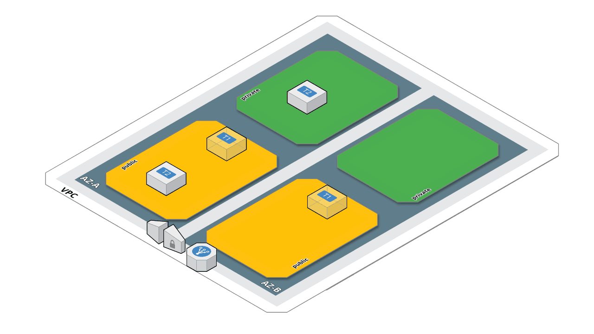

# AWS et le réseaux

## Default VPC

"Le VPC par défaut est prêt à l'emploi, ce qui signifie que vous n'avez pas besoin d'en créer un, ni d'en configurer un, vous-même. Vous pouvez immédiatement lancer des instances Amazon EC2 dans votre VPC par défaut. Vous pouvez également faire appel à des services tels que Elastic Load Balancing, Amazon RDS et Amazon EMR dans votre VPC par défaut.

Un VPC par défaut est la solution idéale pour une mise en route rapide et pour lancer des instances publiques, comme un blog ou un site Internet simple. Vous pouvez modifier les composants du VPC par défaut à votre guise." (Amazon) 

[A lire](http://docs.aws.amazon.com/fr_fr/AmazonVPC/latest/UserGuide/default-vpc.html)

## VPC

Les bonnes pratiques en matière de réseaux AWS se rapproche de [Scénario 3 : VPC avec des sous-réseaux publics et privés, ainsi qu'un accès VPN géré par AWS ](http://docs.aws.amazon.com/fr_fr/AmazonVPC/latest/UserGuide/VPC_Scenario3.html)

A savoir que :
* Les réseaux portent les informations de Netmask et de default Gateway.
* Les EC2 portent des IP, et héritent des propriétés du réseau (netmask, gateway) dans lequel elles sont créées.
* Il est recommandé que les EC2 n'aient qu'une et une seule interface réseau.

On crée donc les réseaux de la manière suivante :

* 1 VPC sur une région
* 1 Internet Gateway dans ce VPC
* Sur 2 zones de disponibilité (minimum) de la région, création dans chaque AZ :
 - 1 réseau publique (en jaune)
 - 1 NAT Gateway, avec une Elastic IP, dans le réseau public (les T1 transparenttes sur le schéma)
 - 1 réseau privé  (en vert)

Un réseau est dit public quand :
* Il est [associé](https://www.terraform.io/docs/providers/aws/r/route_table_association.html) à une [route_table](https://www.terraform.io/docs/providers/aws/r/route_table.html) qui définit la gateway comme étant l'Internet Gateway du VPC..
* On peut y créer des objets qui seront accessible depuis Internet, tel que :
 - Elastic Load Balancer (à coté de l'Internet Gateway)
 - EC2 portant une Elastic IP (la T2 dans le réseau publique) comme un bastion.

Pour les réseaux publics, la route par défaut passe par l'Internet Gateway.  
Pour les réseaux privés, leur toute par défaut passe par la Nat Gateway de l'AZ correspondante.   

Comme les Nat Gateway sont construites dans les réseaux publics, elles routeront le traffic vers Internet à travers l'Internet Gateway qui est la route par défaut des réseaux publics.

## La Sécurité

La sécurité est porté par des [groupes de sécurité](http://docs.aws.amazon.com/fr_fr/AWSEC2/latest/UserGuide/using-network-security.html).  
Une sorte de firewall mais qui serait appliqué sur l'interface réseau de l'EC2.

