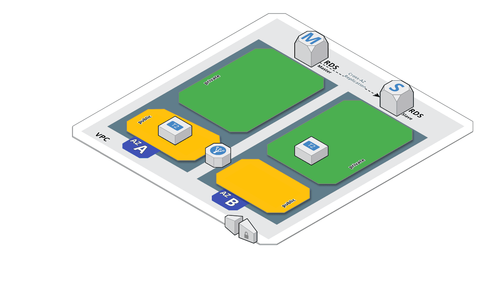

# Atelier Terraform

## Objectif

Construire une plateforme AWS tel que :

* Hébergement d'un Wordpress
* Accès en SSH par rebond sur un bastion
* Base de données MySQL hébergée dans AWS RDS
* Base de données en haute-disponibilité
* Potentiellement hautement redondant (multi-AZ)
* Wordpress servi par un AWS ELB Classic
* Accès aux différents services de manière sécurisée
* Provsionning automatique du Wordpress




## Environement

* Région AWS : eu-west-1
* Avialability Zone (AZ) : eu-west-1a et eu-west-1b
* Type EC2 = t2.micro


## Prérequis

### 1. Logiciels à installer

* [Terraform](https://www.terraform.io/downloads.html)
* AWS Cli pour [Linux/MacOS/Unix](http://docs.aws.amazon.com/fr_fr/cli/latest/userguide/awscli-install-bundle.html) ou [Windows](http://docs.aws.amazon.com/fr_fr/cli/latest/userguide/awscli-install-windows.html)
* GIT
* Un éditeur de texte

### 2. Création d'un compte IAM

Une fois dans la console AWS, aller dans "IAM", et "Users".  
Créer un utilisateur <username>

Récupérer :
* Access key ID 
* Secret Access key ID 

_Attention:_
La "Secret Access Key ID" n'est plus récupérable hors de cette page.  
Si vous ne la récupérer pas vous devrez en recréer une.


### 3. Configuration des "aws cli"

Dans un terminal lancer : 
```
aws configure
```
Renseigner les credentials AWS de votre utilisateur, avec :
* region = eu-west-1
* format = json


## 2. Atelier

### 2.1 Créer un bucket S3

Ce bucket sera utilisé pour stocker le "Remote State" de Terraform.

Créer un bucket S3 dans la région eu-west-1 :
```
aws s3 mb s3://<username> --region eu-west-1
```


### 3. Code Terraform

#### 3.1 Provider et S3

* Configuration du provider [AWS](https://www.terraform.io/docs/providers/aws/index.html)
* Configuration du backend [S3](https://www.terraform.io/docs/backends/types/s3.html)

Une fois ces paramères définis, vous pouvez lancer la commande :

```
terraform init
```

#### 3.2 Réseau

Pour la partie réseau nous allons créer :

* 1 VPC : [aws_vpc](https://www.terraform.io/docs/providers/aws/r/vpc.html)
* 1 Internet Gateway : [aws_internet_gateway](https://www.terraform.io/docs/providers/aws/r/internet_gateway.html)
* 1 route par défaut : [aws_route_table](https://www.terraform.io/docs/providers/aws/r/route_table.html)
* 1 subnet public dans chaque AZ : [aws_subnet](https://www.terraform.io/docs/providers/aws/r/subnet.html)
* 1 association par subnet publique à la route par défaut : [aws_route_table_association](https://www.terraform.io/docs/providers/aws/r/route_table_association.html)
* 2 Elastic IP [aws_eip](https://www.terraform.io/docs/providers/aws/r/eip.html) 
* 1 Nat Gateway utilisant chacune une EIP, dans chaque subnet public : [aws_nat_gateway](https://www.terraform.io/docs/providers/aws/r/nat_gateway.html)
* 2 subnets privés : [aws_subnet](https://www.terraform.io/docs/providers/aws/r/subnet.html)
* 1 route par defaut empruntant une Nat Gateway pour chaque réseau privé [aws_route_table](https://www.terraform.io/docs/providers/aws/r/route_table.html)
* 1 association par subnet privé à la Nat Gateway de sa région : [aws_route_table_association](https://www.terraform.io/docs/providers/aws/r/route_table_association.html)

Une fois ces fichiers créés, vous pouvez lancer la commande :

```
terraform plan
```

Si cela se passe bien, lancer la commande :

```
terraform apply
```

NB: Il est conseillé de lancer "terraform plan" après chaque étape, plutôt que tout d'un coup.

#### 3.3. Bastion

* Création d'une pair de clef ssh :

```
ssh-keygen -t rsa -b 2048 -f atelier
```
* Créer la clef publique : [aws_key_pair](https://www.terraform.io/docs/providers/aws/r/key_pair.html)
* Création d'un Security Group : [aws_security_group](https://www.terraform.io/docs/providers/aws/r/security_group.html) pour accéder au bastion en SSH
* Création d'une EIP : [aws_eip](https://www.terraform.io/docs/providers/aws/r/eip.html)
* Création d'une EC2 : [aws_instance](https://www.terraform.io/docs/providers/aws/r/instance.html)
* Associtation de cette EC2 à l'EIP : [aws_eip_association](https://www.terraform.io/docs/providers/aws/r/eip_association.html)


#### 3.4 Instance MySQL

* Créer d'un Security Group : [aws_security_group](https://www.terraform.io/docs/providers/aws/r/security_group.html) pour accéder à l'instance RDS MySQL
* Créer un DB Subnet :  [aws_db_subnet_group](https://www.terraform.io/docs/providers/aws/r/db_subnet_group.html)
* Créer une Instance RDS : [aws_db_instance](https://www.terraform.io/docs/providers/aws/r/db_instance.html)


#### 3.5 Serveur Wordpress

* Créer un Security Group : [aws_security_group](https://www.terraform.io/docs/providers/aws/r/security_group.html) pour y accéder en HTTP, et SSH à partir du bastion
* Créer un Volume EBS pour "/space" : [aws_ebs_volume](https://www.terraform.io/docs/providers/aws/r/ebs_volume.html) 
* Créer une Instance EC2 : [aws_instance](https://www.terraform.io/docs/providers/aws/r/instance.html) [^1]
* Utiliser le [provider template](https://www.terraform.io/docs/providers/template/index.html) pour le [user_data](https://www.terraform.io/docs/providers/aws/r/instance.html#user_data) de la VM [^2]
* Créer un attachement EBS/EC2 : [aws_volume_attachment](https://www.terraform.io/docs/providers/aws/r/volume_attachment.html) Pour brancher le disque.

#### 3.6 ELB Classic

* Créer un Security Group : [aws_security_group](https://www.terraform.io/docs/providers/aws/r/security_group.html) pour y accéder en HTTP à l'ELB
* Créer un Load Balancer Classic : [aws_elb](https://www.terraform.io/docs/providers/aws/r/elb.html)
* Créer un attachement EC2/ELB : [aws_elb_attachment](https://www.terraform.io/docs/providers/aws/r/elb_attachment.html)

## Fin de l'atelier

Lancer la commande :

```
terraform destroy -force
```

afin de détruire tout ce que vos fichiers ont créé.

